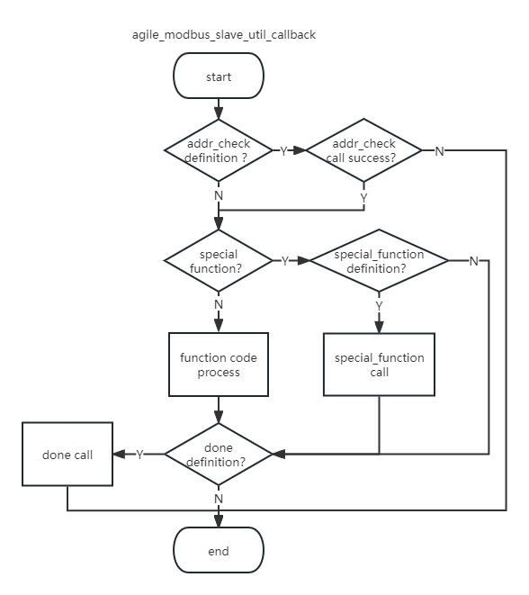

# Agile Modbus

## 1. Introduction

Agile Modbus is a lightweight modbus protocol stack that meets the needs of users in any scenario.


- Online documentation: [API Manual](https://loogg.github.io/agile_modbus/)

- The `examples` folder provides examples on PC

- See examples on MCU [mcu_demos](https://github.com/loogg/agile_modbus_mcu_demos)

- Bootloader based on RT-Thread on AT32F437 that supports Modbus firmware upgrade: [AT32F437_Boot](https://github.com/loogg/AT32F437_Boot)

- Bootloader based on RT-Thread on HPM6750 that supports Modbus firmware upgrade: [HPM6750_Boot](https://github.com/loogg/HPM6750_Boot)

### 1.1. Features

1. Supports rtu and tcp protocols, is developed using pure C, does not involve any hardware interface, and can be used directly on any form of hardware.
2. Since it is developed using pure C and does not involve hardware, it can run the tcp protocol on the serial port and the rtu protocol on the network.
3. Support custom protocols compliant with modbus format.
4. Supports multiple masters and multiple slaves at the same time.
5. It is easy to use. You only need to initialize the rtu or tcp handle and call the corresponding API to package and unpack.

### 1.2. Directory structure

| Name | Description |
| ---- | ---- |
| doc | documentation |
| examples | examples |
| figures | materials |
| inc  | header file |
| src  | source code |
| util | Provides simple and practical components |

### 1.3. License

Agile Modbus complies with the `Apache-2.0` license, see the `LICENSE` file for details.

## 2. Use Agile Modbus

Please view the help document [doc/doxygen/Agile_Modbus.chm](./doc/doxygen/Agile_Modbus.chm)

### 2.1. Transplantation

- Users need to implement the `send data`, `wait for data reception to end` and `clear the receive buffer` functions of the hardware interface

  Regarding `waiting for data reception to end`, the following ideas are provided:

  1. General method

     Every 20 /50 ms (this time can be set according to the baud rate and hardware, here is just a reference value) reads data from the hardware interface and stores it in the buffer and updates the offset until it cannot be read or the buffer is full. , exit reading.

     This applies to both bare metal and operating systems, which can accomplish blocking via `select` or `semaphore`.

  2. Serial port `DMA + IDLE` interrupt mode

     Configure the `DMA + IDLE` interrupt, enable the flag in the interrupt, and determine whether the flag is set in the application program.

     However, this solution is prone to problems. If the data bytes are slightly staggered, it will not be a frame. The first option is recommended.

- Host:

  1. `agile_modbus_rtu_init` / `agile_modbus_tcp_init` initializes `RTU/TCP` environment
  2. `agile_modbus_set_slave` sets the slave address
  3. `Clear the receive cache`
  4. `agile_modbus_serialize_xxx` package request data
  5. `Send data`
  6. `Waiting for data reception to end`
  7. `agile_modbus_deserialize_xxx` Parse response data
  8. Data processed by users

- Slave machine:

  1. Implement the `agile_modbus_slave_callback_t` type callback function
  2. `agile_modbus_rtu_init` / `agile_modbus_tcp_init` initializes `RTU/TCP` environment
  3. `agile_modbus_set_slave` sets the slave address
  4. `Waiting for data reception to end`
  5. `agile_modbus_slave_handle` processes request data
  6. `Clear the receive buffer` (optional)
  7. `Send data`

- Special function code

  You need to call the `agile_modbus_set_compute_meta_length_after_function_cb` and `agile_modbus_set_compute_data_length_after_meta_cb` APIs to set the callbacks for special function codes to be processed in master-slave mode.

  - `agile_modbus_set_compute_meta_length_after_function_cb`

    `msg_type == AGILE_MODBUS_MSG_INDICATION`: Returns the data element length of the host request message (uint8_t type). If it is not a special function code, 0 must be returned.

    `msg_type == MSG_CONFIRMATION`: Returns the data element length (uint8_t type) of the slave response message. If it is not a special function code, 1 must be returned.

  - `agile_modbus_set_compute_data_length_after_meta_cb`

    `msg_type == AGILE_MODBUS_MSG_INDICATION`: Returns the data length after the data element of the host request message. If it is not a special function code, 0 must be returned.

    `msg_type == MSG_CONFIRMATION`: Returns the data length after the data element of the slave response message. If it is not a special function code, it must return 0.

- `agile_modbus_rtu_init` / `agile_modbus_tcp_init`

  When initializing the `RTU/TCP` environment, the user needs to pass in the `send buffer` and `receive buffer`. It is recommended that the size of both buffers is `AGILE_MODBUS_MAX_ADU_LENGTH` (260) bytes. `Special function code` is determined by the user according to the agreement.

  But for small memory MCUs, these two buffers can also be set small, and all APIs will judge the buffer size:

  Send buffer setting: If `expected request data length` or `expected response data length` is greater than `set send buffer size`, an exception is returned.

  Receive buffer setting: If the `message length requested by the host` is greater than the `set receive buffer size`, an exception will be returned. This is reasonable. When a small memory MCU is used as a slave, certain function codes must be restricted.

### 2.2. Host

See `2.1. Transplantation`.

### 2.3. Slave machine

#### 2.3.1. Interface description

- Introduction to `agile_modbus_slave_handle`

  ```c

  int agile_modbus_slave_handle(agile_modbus_t *ctx, int msg_length, uint8_t slave_strict,
                                agile_modbus_slave_callback_t slave_cb, const void *slave_data, int *frame_length)

  ```

  msg_length: The length of data received after `waiting for the end of data reception`.

  slave_strict: slave address strictness check (0: Do not judge whether the address is consistent, it will be processed by user callback; 1: The address must be consistent, otherwise the callback will not be called and the response data will not be packaged).

  slave_cb: `agile_modbus_slave_callback_t` type callback function, implemented and passed in by the user. If it is NULL, all function codes can respond and are successful, but the register data is still 0.

  slave_data: slave callback function private data.

  frame_length: Get the length of the parsed modbus data frame. The meaning of this parameter is:
    1. There is dirty data at the end: it can still be parsed successfully and tells the user the real modbus frame length, which the user can process.
    2. Data sticky packet: The data consists of a complete frame of modbus data + a partial modbus data frame. After the user obtains the real modbus frame length, he can remove the processed modbus data frame and read the hardware interface data and the current one again. Part of the modbus data frame forms a new frame
    3. This parameter is often used when modbus broadcast transmits big data (such as custom function code broadcast to upgrade firmware). Ordinary slave responses are one question and one answer, and only the complete data frame is processed. It is recommended to Execute `clear receive cache`

- Introduction to `agile_modbus_slave_callback_t`

  ```c

  /**
   * @brief   slave callback function
   * @param   ctx modbus handle
   * @param   slave_info slave information body
   * @param   data private data
   * @return  =0: normal;
   *          <0: Abnormal
   *             (-AGILE_MODBUS_EXCEPTION_UNKNOW(-255): Unknown exception, the slave will not package the response data)
   *             (Other negative exception codes: package exception response data from the opportunity)
   */
  typedef int (*agile_modbus_slave_callback_t)(agile_modbus_t *ctx, struct agile_modbus_slave_info *slave_info, const void *data);

  ```

  `agile_modbus_slave_info`:

  sft: Contains slave address and function code attributes, which can be used in callbacks

  rsp_length: response data length pointer, its value needs to be updated when processing `special function code` in the callback, otherwise **not allowed to change**

  address: register address (not used by all function codes)

  nb: number (not used by all function codes)

  buf: data field required by different function codes (not used by all function codes)

  send_index: the current index of the send buffer (not used by all function codes)

- `agile_modbus_slave_info` used by different function codes

  - AGILE_MODBUS_FC_READ_COILS、AGILE_MODBUS_FC_READ_DISCRETE_INPUTS

    The `address`, `nb`, and `send_index` attributes need to be used, and the `agile_modbus_slave_io_set` API needs to be called to store the IO data in the data area starting from `ctx->send_buf + send_index`.

  - AGILE_MODBUS_FC_READ_HOLDING_REGISTERS、AGILE_MODBUS_FC_READ_INPUT_REGISTERS

    The `address`, `nb`, and `send_index` attributes need to be used, and the `agile_modbus_slave_register_set` API needs to be called to store the register data in the data area starting from `ctx->send_buf + send_index`.

  - AGILE_MODBUS_FC_WRITE_SINGLE_COIL、AGILE_MODBUS_FC_WRITE_SINGLE_REGISTER

    You need to use the `address` and `buf` attributes, force `buf` to the `int *` type, and get the value and store it in a register.

  - AGILE_MODBUS_FC_WRITE_MULTIPLE_COILS

    The `address`, `nb`, `buf` attributes need to be used, and the `agile_modbus_slave_io_get` API needs to be called to obtain the IO data to be written.

  - AGILE_MODBUS_FC_WRITE_MULTIPLE_REGISTERS

    The `address`, `nb`, and `buf` attributes need to be used, and the `agile_modbus_slave_register_get` API needs to be called to obtain the register data to be written.

  - AGILE_MODBUS_FC_MASK_WRITE_REGISTER

    You need to use the `address` and `buf` attributes, pass `(buf[0] << 8) + buf[1]` to get the `and` value, pass `(buf[2] << 8) + buf[3 ]` Gets the `or` value. Get the register value `data`, perform the `data = (data & and) | (or & (~and))` operation to update the `data` value, and write it to the register.

  - AGILE_MODBUS_FC_WRITE_AND_READ_REGISTERS

    You need to use the `address`, `buf`, `send_index` attributes, pass `(buf[0] << 8) + buf[1]` to get the number of registers to be read, pass `(buf[2] << 8) + buf[3]` Get the register address to be written, and use `(buf[4] << 8) + buf[5]` to get the number of registers to be written. You need to call the `agile_modbus_slave_register_get` API to obtain the register data to be written, and call the `agile_modbus_slave_register_set` API to store the register data in the data area starting from `ctx->send_buf + send_index`.

  - Custom function code

    You need to use the `send_index`, `nb`, and `buf` attributes, and the user processes the data in the callback.

    send_index: current index of send buffer

    nb: PUD - 1, which is the modbus data field length

    buf: starting position of modbus data field

    **Note**: After the user fills data into the send buffer in the callback, the `rsp_length` value of `agile_modbus_slave_info` needs to be updated.

#### 2.3.2. Simple slave access interface

Agile Modbus provides an implementation of `agile_modbus_slave_callback_t`, allowing users to access it simply and conveniently.

See [examples/slave](./examples/slave) for examples of usage.

How to use:

```c

#include "agile_modbus.h"
#include "agile_modbus_slave_util.h"

const agile_modbus_slave_util_t slave_util = {
  /* User implementation */

};

agile_modbus_slave_handle(ctx, read_len, 0, agile_modbus_slave_util_callback, &slave_util, NULL);

```

- Introduction to `agile_modbus_slave_util_callback`

  - An implementation of `agile_modbus_slave_callback_t` provided by Agile Modbus, which requires `agile_modbus_slave_util_t` type variable pointer as private data.

  - The private data is NULL, all function codes can respond and are successful, but the register data is still 0.

- Introduction to `agile_modbus_slave_util_t`

  ```c

  typedef struct agile_modbus_slave_util {
      const agile_modbus_slave_util_map_t *tab_bits;                                            /**< Coil register definition array */
      int nb_bits;                                                                              /**< Number of coil register definition arrays */
      const agile_modbus_slave_util_map_t *tab_input_bits;                                      /**< Discrete input register definition array */
      int nb_input_bits;                                                                        /**< Number of discrete input register definition arrays */
      const agile_modbus_slave_util_map_t *tab_registers;                                       /**< Holding register definition array */
      int nb_registers;                                                                         /**< Number of holding register definition arrays */
      const agile_modbus_slave_util_map_t *tab_input_registers;                                 /**< Input register definition array */
      int nb_input_registers;                                                                   /**< Number of input register definition arrays */
      int (*addr_check)(agile_modbus_t *ctx, struct agile_modbus_slave_info *slave_info);       /**< Address check interface */
      int (*special_function)(agile_modbus_t *ctx, struct agile_modbus_slave_info *slave_info); /**< Special function code processing interface */
      int (*done)(agile_modbus_t *ctx, struct agile_modbus_slave_info *slave_info, int ret);    /**< Processing end interface */
  } agile_modbus_slave_util_t;

  ```

  - Register related

    Users need to implement the definitions of `bits`, `input_bits`, `registers` and `input_registers`. If a register is defined as NULL, the function code corresponding to the register can respond and is successful, but the register data is all 0.

  - Interface calling process

    

- Introduction to `agile_modbus_slave_util_map`

  ```c

  typedef struct agile_modbus_slave_util_map {
      int start_addr;                                       /**< starting address */
      int end_addr;                                         /**< end address */
      int (*get)(void *buf, int bufsz);                     /**< Get register data interface */
      int (*set)(int index, int len, void *buf, int bufsz); /**< Set register data interface */
  } agile_modbus_slave_util_map_t;

  ```

  - **Precautions**:

    - The number of registers determined by the start address and end address is limited. Changing the size of the `map_buf` array inside the function can make it larger.

      - bit register < 250

      - register register < 125

    - The interface function is NULL, and the function code corresponding to the register can respond and is successful.

  - `get` interface

    Copy all data in the address field to `buf`.

  - `set` interface

    - `index`: offset within the address field

    - `len`: length

    Modify data based on `index` and `len`.

### 2.4. Example

- Examples on PC are provided in the [examples](./examples) folder, which can be compiled and run under `WSL` or `Linux`.

  - Examples of RTU/TCP master and slave

  - Examples of special function codes

    RTU point-to-point transmission of files: Demonstrates the use of special function codes

    RTU broadcast transmission file: Demonstrates the use of `frame_length` in `agile_modbus_slave_handle`

- [mcu_demos](https://github.com/loogg/agile_modbus_mcu_demos) provides examples on MCU.

- [AT32F437_Boot](https://github.com/loogg/AT32F437_Boot) A Bootloader based on RT-Thread implemented on AT32F437 that supports Modbus firmware upgrade.

- [HPM6750_Boot](https://github.com/loogg/HPM6750_Boot) A Bootloader based on RT-Thread implemented on HPM6750 that supports Modbus firmware upgrade.

### 2.5. Doxygen document generation

- Use `Doxywizard` to open [Doxyfile](./doc/doxygen/Doxyfile) and run it. The generated file will be under [doxygen/output](./doc/doxygen/output).
- `Graphviz` path needs to be changed.
- `HTML` is generated without using `chm` format. If it is enabled, you need to change the `hhc.exe` path.

## 3. Support


If Agile Modbus solves your problem, you might as well scan the QR code above and invite me for a **cup of coffee** ~

## 4. Contact information & thanks

- Maintenance: Ma Longwei
- Home page: <https://github.com/loogg/agile_modbus>
- Email: <2544047213@qq.com>
