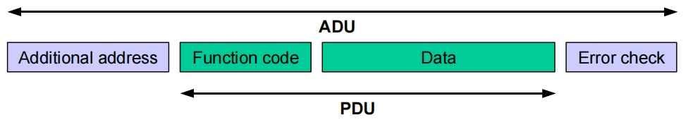

# Agile Modbus

## 1、介绍

Agile Modbus 即：轻量型 modbus 协议栈，满足用户任何场景下的使用需求。



### 1.1、特性

1. 支持 rtu 及 tcp 协议，使用纯 C 开发，不涉及任何硬件接口，可在任何形式的硬件上直接使用。
2. 由于其使用纯 C 开发、不涉及硬件，完全可以在串口上跑 tcp 协议，在网络上跑 rtu 协议。
3. 支持符合 modbus 格式的自定义协议。
4. 同时支持多主机和多从机。
5. 使用简单，只需要将 rtu 或 tcp 句柄初始化好后，调用相应 API 进行组包和解包即可。

### 1.2、目录结构

| 名称 | 说明 |
| ---- | ---- |
| doc | 文档 |
| examples | 例子 |
| figures | 素材 |
| inc  | 头文件 |
| src  | 源代码 |

### 1.3、资源占用

| 环境 | FLASH | RAM |
| ---- | ---- | ---- |
| KEIL | 7192 | 0 |
| GCC | 13970 | 24 |

### 1.4、许可证

Agile Modbus 遵循 LGPLv2.1 许可，详见 `LICENSE` 文件。

## 2、使用 Agile Modbus

- 帮助文档请查看 [doc/doxygen/Agile_Modbus.chm](./doc/doxygen/Agile_Modbus.chm)

- 用户需要实现硬件接口的 `发送数据` 、 `等待数据接收结束` 、 `清空接收缓存` 函数

  对于 `等待数据接收结束`，提供如下几点思路：

  1. 通用方法

     每隔 20 / 50 ms (该时间可根据波特率和硬件设置，这里只是给了参考值) 从硬件接口读取数据存放到缓冲区中并更新偏移，直到读取不到或缓冲区满，退出读取。

     这对于裸机或操作系统都适用，操作系统可通过 `select` 或 `信号量` 方式完成阻塞。

  2. 串口 `DMA + IDLE` 中断方式

     配置 `DMA + IDLE` 中断，在中断中使能标志，应用程序中判断该标志是否置位即可。

     但该方案容易出问题，数据字节间稍微错开一点时间就不是一帧了。推荐第一种方案。

- 主机：

  1. `agile_modbus_rtu_init` / `agile_modbus_tcp_init` 初始化 `RTU/TCP` 环境
  2. `agile_modbus_set_slave` 设置从机地址
  3. `清空接收缓存`
  4. `agile_modbus_serialize_xxx` 打包请求数据
  5. `发送数据`
  6. `等待数据接收结束`
  7. `agile_modbus_deserialize_xxx` 解析响应数据
  8. 用户处理得到的数据

- 从机：

  1. 实现 `agile_modbus_slave_callback_t` 类型回调函数
  2. `agile_modbus_rtu_init` / `agile_modbus_tcp_init` 初始化 `RTU/TCP` 环境
  3. `agile_modbus_set_slave` 设置从机地址
  4. `等待数据接收结束`
  5. `agile_modbus_slave_handle` 处理请求数据
  6. `清空接收缓存` (可选)
  7. `发送数据`

- 特殊功能码

  需要调用 `agile_modbus_set_compute_meta_length_after_function_cb` 和 `agile_modbus_set_compute_data_length_after_meta_cb` API 设置特殊功能码在主从模式下处理的回调。

  - `agile_modbus_set_compute_meta_length_after_function_cb`

    `msg_type == AGILE_MODBUS_MSG_INDICATION`: 返回主机请求报文的数据元长度(uint8_t 类型)，不是特殊功能码必须返回 0。

    `msg_type == MSG_CONFIRMATION`: 返回从机响应报文的数据元长度(uint8_t 类型)，不是特殊功能码必须返回 1。

  - `agile_modbus_set_compute_data_length_after_meta_cb`

    `msg_type == AGILE_MODBUS_MSG_INDICATION`: 返回主机请求报文数据元之后的数据长度，不是特殊功能码必须返回 0。

    `msg_type == MSG_CONFIRMATION`: 返回从机响应报文数据元之后的数据长度，不是特殊功能码必须返回 0。

- `agile_modbus_rtu_init` / `agile_modbus_tcp_init`

  初始化 `RTU/TCP` 环境时需要用户传入 `发送缓冲区` 和 `接收缓冲区`，建议这两个缓冲区大小都为 `AGILE_MODBUS_MAX_ADU_LENGTH` (260) 字节。`特殊功能码` 情况用户根据协议自行决定。

  但对于小内存 MCU，这两个缓冲区也可以设置小，所有 API 都会对缓冲区大小进行判断：

  发送缓冲区设置：如果 `预期请求的数据长度` 或 `预期响应的数据长度` 大于 `设置的发送缓冲区大小`，返回异常。

  接收缓冲区设置：如果 `主机请求的报文长度` 大于 `设置的接收缓冲区大小`，返回异常。这个是合理的，小内存 MCU 做从机肯定是需要对某些功能码做限制的。

- `agile_modbus_slave_handle` 介绍

  ```C

  int agile_modbus_slave_handle(agile_modbus_t *ctx, int msg_length, uint8_t slave_strict,
                              agile_modbus_slave_callback_t slave_cb, int *frame_length)

  ```

  msg_length: `等待数据接收结束` 后接收到的数据长度

  slave_strict: 从机地址严格性检查 (0: 不判断地址是否一致，由用户回调处理; 1: 地址必须一致，否则不会调用回调，也不打包响应数据)。

  slave_cb: `agile_modbus_slave_callback_t` 类型回调函数，用户实现并传入。如果为 NULL，所有功能码都能响应且为成功，但寄存器数据依然为 0。

  frame_length: 获取解析出的 modbus 数据帧长度。这个参数的意义在于：
    1. 尾部有脏数据: 仍能解析成功，并告诉用户真实的 modbus 帧长，用户可以进行处理
    2. 数据粘包: 数据由 `一帧完整的 modbus 数据 + 部分 modbus 数据帧` 组成，用户获得真实 modbus 帧长后，可以移除处理完的 modbus 数据帧，再次读取硬件接口数据与当前 `部分 modbus 数据帧` 组成新的一帧
    3. 该参数在 modbus 广播传输大数据时使用较多(如：自定义功能码广播升级固件)，普通的从机响应都是一问一答式，只处理完整数据帧就行，建议在响应前执行 `清空接收缓存`

- `agile_modbus_slave_callback_t` 介绍

  ```C

  /**
  * @return  =0:正常;
  *          <0:异常
  *             (-AGILE_MODBUS_EXCEPTION_UNKNOW(-255): 未知异常，从机不会打包响应数据)
  *             (其他负数异常码: 从机会打包异常响应数据)
  */
  typedef int (*agile_modbus_slave_callback_t)(agile_modbus_t *ctx, struct agile_modbus_slave_info *slave_info);

  ```

  `agile_modbus_slave_info`:

  sft: 包含从机地址和功能码属性，回调中可利用

  rsp_length: 响应数据长度指针，回调中处理 `特殊功能码` 时需要更新其值，否则 **不准更改**

  address: 寄存器地址 (不是所有功能码都用到)

  nb: 数目 (不是所有功能码都用到)

  buf: 不同功能码需要使用的数据域 (不是所有功能码都用到)

  send_index: 发送缓冲区当前索引 (不是所有功能码都用到)

- `agile_modbus_slave_info` 不同功能码使用

  - AGILE_MODBUS_FC_READ_COILS、AGILE_MODBUS_FC_READ_DISCRETE_INPUTS

    需要使用到 `address`、`nb`、`send_index` 属性，需要调用 `agile_modbus_slave_io_set` API 将 IO 数据存放到 `ctx->send_buf + send_index` 开始的数据区域。

  - AGILE_MODBUS_FC_READ_HOLDING_REGISTERS、AGILE_MODBUS_FC_READ_INPUT_REGISTERS

    需要使用到 `address`、`nb`、`send_index` 属性，需要调用 `agile_modbus_slave_register_set` API 将寄存器数据存放到 `ctx->send_buf + send_index` 开始的数据区域。

  - AGILE_MODBUS_FC_WRITE_SINGLE_COIL、AGILE_MODBUS_FC_WRITE_SINGLE_REGISTER

    需要使用到 `address`、`buf` 属性，将 `buf` 强转为 `int *` 类型，获取值存放到寄存器中。

  - AGILE_MODBUS_FC_WRITE_MULTIPLE_COILS

    需要使用到 `address`、`nb`、`buf` 属性，需要调用 `agile_modbus_slave_io_get` API 获取要写入的 IO 数据。

  - AGILE_MODBUS_FC_WRITE_MULTIPLE_REGISTERS

    需要使用到 `address`、`nb`、`buf` 属性，需要调用 `agile_modbus_slave_register_get` API 获取要写入的寄存器数据。

  - AGILE_MODBUS_FC_MASK_WRITE_REGISTER

    需要使用到 `address`、`buf` 属性，通过 `(buf[0] << 8) + buf[1]` 获取 `and` 值，通过 `(buf[2] << 8) + buf[3]` 获取 `or` 值。获取寄存器值 `data`，进行 `data = (data & and) | (or & (~and))` 操作更新 `data` 值，写入寄存器。

  - AGILE_MODBUS_FC_WRITE_AND_READ_REGISTERS

    需要使用到 `address`、`buf`、`send_index` 属性，通过 `(buf[0] << 8) + buf[1]` 获取要读取的寄存器数目，通过 `(buf[2] << 8) + buf[3]` 获取要写入的寄存器地址，通过 `(buf[4] << 8) + buf[5]` 获取要写入的寄存器数目。需要调用 `agile_modbus_slave_register_get` API 获取要写入的寄存器数据，调用 `agile_modbus_slave_register_set` API 将寄存器数据存放到 `ctx->send_buf + send_index` 开始的数据区域。

  - 自定义功能码

    需要使用到 `send_index`、`nb`、`buf` 属性，用户在回调中处理数据。

    send_index: 发送缓冲区当前索引

    nb: PUD - 1，也就是 modbus 数据域长度

    buf: modbus 数据域起始位置

    **注意**: 用户在回调中往发送缓冲区填入数据后，需要更新 `agile_modbus_slave_info` 的 `rsp_length` 值。

### 2.1、示例

[examples](./examples) 文件夹中提供 PC 上的示例，可以在 `WSL` 或 `Linux` 下编译运行。

- RTU / TCP 主机、从机的示例

- 特殊功能码的示例

  RTU 点对点传输文件: 演示特殊功能码的使用方式

  RTU 广播传输文件: 演示 `agile_modbus_slave_handle` 中 `frame_length` 的用处

`agile_modbus_mcu_demos` <https://github.com/loogg/agile_modbus_mcu_demos> 提供在 MCU 上的例子。

### 2.2、Doxygen 文档生成

- 使用 `Doxywizard` 打开 [Doxyfile](./doc/doxygen/Doxyfile) 运行，生成的文件在 [doxygen/output](./doc/doxygen/output) 下。
- 需要更改 `Graphviz` 路径。
- `HTML` 生成未使用 `chm` 格式的，如果使能需要更改 `hhc.exe` 路径。

## 3、联系方式 & 感谢

- 维护：马龙伟
- 主页：<https://github.com/loogg/agile_modbus>
- 邮箱：<2544047213@qq.com>
